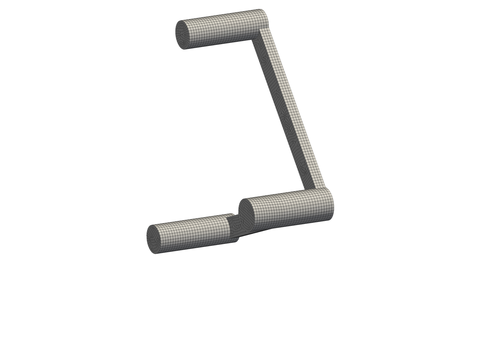

# MeshRender Studio

MeshRender Studio is a local Flask application for preparing engineering mesh data, rendering clean ParaView figures, and reviewing results without hand-editing JSON.

MeshRender Studio 是一个本地 Flask 工具，用于整理工程网格数据、调用 ParaView 渲染高质量图片，并在无需手改 JSON 的情况下完成查看与管理。



## Features / 功能

- Import Abaqus `.inp`, AQWA `.LIS`, `.vtu`, and `.vtk` sources.
- Edit shared render settings and manage reusable source/view presets.
- Adjust `azimuth`, `elevation`, and `roll` with degree-based sliders.
- Queue mesh preparation and ParaView rendering from the browser.
- Save projects locally and review generated figures and mesh outputs.
- 支持导入 Abaqus `.inp`、AQWA `.LIS`、`.vtu`、`.vtk`。
- 支持统一渲染参数、可复用视角与数据源配置。
- 支持用角度滑块调整 `azimuth`、`elevation`、`roll`。
- 可在浏览器内执行网格预处理与 ParaView 渲染。
- 支持本地保存项目，并查看生成的图片和网格文件。

## Install / 安装

```bash
python3 -m pip install -e .
```

ParaView `pvpython` must be available from `PVPYTHON`, `PATH`, or `/Applications/ParaView-6.1.0.app/Contents/bin/pvpython`.

需要保证 ParaView `pvpython` 可通过 `PVPYTHON`、`PATH` 或 `/Applications/ParaView-6.1.0.app/Contents/bin/pvpython` 访问。

## Run / 运行

```bash
python3 -m meshrender_studio.app
```

Open `http://127.0.0.1:5000`.

打开 `http://127.0.0.1:5000`。

## Project Layout / 项目目录

- `meshrender_studio/`: application package, Flask UI, and rendering logic.
- `projects/`: saved project JSON files created locally at runtime.
- `workspace/<project-id>/inputs/`: imported source files.
- `workspace/<project-id>/mesh/`: generated VTU meshes.
- `workspace/<project-id>/figures/`: rendered PNG figures.
- `meshrender_studio/`：应用包、Flask 界面与渲染逻辑。
- `projects/`：运行时本地保存的项目 JSON。
- `workspace/<project-id>/inputs/`：导入的源文件。
- `workspace/<project-id>/mesh/`：生成的 VTU 网格。
- `workspace/<project-id>/figures/`：生成的 PNG 图片。

## Guides / 使用文档

- English: [docs/user-guide.en.md](docs/user-guide.en.md)
- 中文: [docs/user-guide.zh-CN.md](docs/user-guide.zh-CN.md)

## Author / 作者

- Shuijin Li
- shuijinli@outlook.com

## License / 许可

MIT. See [LICENSE](LICENSE).
